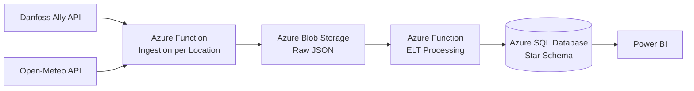

# HumidityService

An enterprise-grade .NET 10 cloud service designed for Azure. It automates the extraction, transformation, and loading (ELT) of indoor temperature and humidity telemetry from the Danfoss Ally API and outdoor meteorological data from Open-Meteo, across one or more configured locations, into an Azure SQL Database for Power BI consumption.


## Architecture Overview

The system strictly follows **Clean Architecture** principles to isolate the core domain business rules from external frameworks, infrastructure, and presentation details:

* **Domain**: Contains basic domain abstractions, climate models, and validation logic. Free of external dependencies.
* **Application**: Houses the orchestration of ELT flows, data transformation mappings, and business rules.
* **Infrastructure**: Implements data persistence, external API clients, managed identity for SQL database login, and resilience retry strategies.
* **Function Host**: Entry point managing the cron configurations, dependency injection wire-ups, and configuration management.



## Tech Stack

* **Runtime:** .NET 10
* **Cloud Platform:** Azure (Functions, Blob Storage, SQL Database, Key Vault, VNet)
* **External APIs:** Danfoss Ally API (indoor climate), Open-Meteo API (outdoor climate)
* **Infrastructure as Code:** Terraform
* **CI/CD:** GitHub Actions
* **Database ORM:** Entity Framework Core (Star Schema Design)
* **Resilience:** Polly (Retry policies for OAuth, REST, Blob, and SQL)
* **Observability:** OpenTelemetry & Azure Application Insights
* **Testing:** xUnit & NSubstitute

## ELT Flow

1. A timer-triggered Azure Function executes hourly and iterates over all configured locations.
2. For each location, indoor climate data is retrieved from the Danfoss Ally API and outdoor climate data is retrieved from Open-Meteo. A failure for one location does not block processing of the others.
3. Raw JSON payloads are persisted to Azure Blob Storage, one blob per location per source (indoor/outdoor).
4. Processing services transform raw payloads into dimensional models, validating incoming payloads and routing corrupt or unparseable files to a dedicated `dead-letter` container.
5. Fact and dimension records are synchronized into Azure SQL Database.
6. Power BI consumes the dimensional model for reporting.


## Data Warehouse Schema

The Azure SQL Database implements a dimensional Star Schema modeled using Entity Framework Core:
* **Fact Tables:** `FactIndoorClimateReading` and `FactOutdoorClimateReading` (Metrics: Temperature, Humidity)
* **Dimension Tables:** `DimDate`, `DimTime`, `DimLocationRoom`


## Data Integrity

The ELT process is fully idempotent.
Duplicate source payloads never create duplicate fact records.
Incoming payloads are validated against the expected schema; invalid or malformed records are logged without halting the pipeline, and corrupt or unparseable source files are routed to a dedicated `dead-letter` blob storage container.

## Getting Started

### Prerequisites
* .NET 10 SDK
* Azure CLI
* Terraform CLI
* Azurite (Local Azure Storage Emulator)

### Local Configuration
Ensure Azurite is running for local blob management. Create a `local.settings.json` file inside the `FunctionHost` project directory:

```json
{
  "IsEncrypted": false,
  "Values": {
    "AzureWebJobsStorage": "UseDevelopmentStorage=true",
    "FUNCTIONS_WORKER_RUNTIME": "dotnet-isolated",
    "DanfossApi__BaseUrl": "https://api.danfoss.com",
    "OpenMeteoApi__BaseUrl": "https://api.open-meteo.com",
    "Locations": "[{\"slug\":\"aarhus-house1\",\"danfossDeviceId\":\"<device-id>\",\"latitude\":56.1629,\"longitude\":10.2039}]",
    "SqlConnectionString": "Server=localhost;Database=HumidityDwh;Trusted_Connection=True;"
  }
}
```

### Running Tests
To execute the automated unit test suite utilizing NSubstitute:
```bash
dotnet test
```

### Deploying Infrastructure
Navigate to the Terraform folder to manage environment deployments:
```bash
terraform init
terraform workspace select development
terraform apply
```

## CI/CD
1. Build
2. Unit Tests
3. Terraform Plan
4. Terraform Apply
5. EF Migration
6. Function Deployment

## Monitoring & Operations
Application logs and traces are structured via OpenTelemetry. Live monitoring dashboards, ingestion health states, ELT processing metrics, and operational alerts are available through Azure Application Insights.

## Security

* Azure Key Vault for secret management
* Zero secrets committed to source control
* VNet integration for SQL access restriction
* Azure Managed Identity authentication for Azure SQL Database

### Local Development
For local development a SQL connection string may be used.
Production environments rely exclusively on Managed Identity authentication.

### Future Enhancements
Simple temperature control based on humidity readings
AI temperature control based on humidity readings from weather forecast and actual measurements